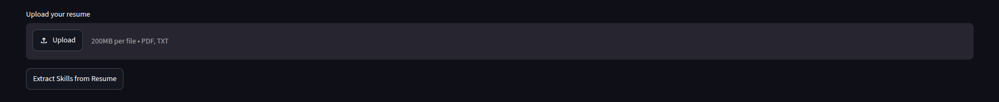
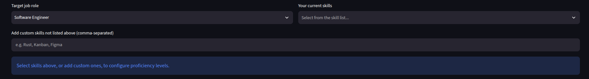
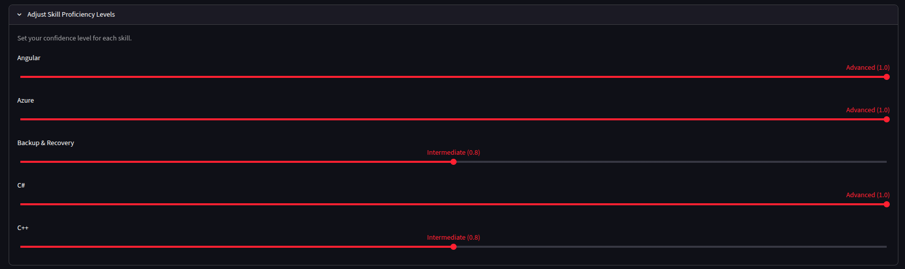
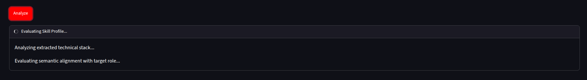
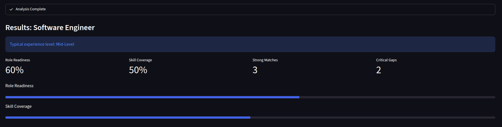
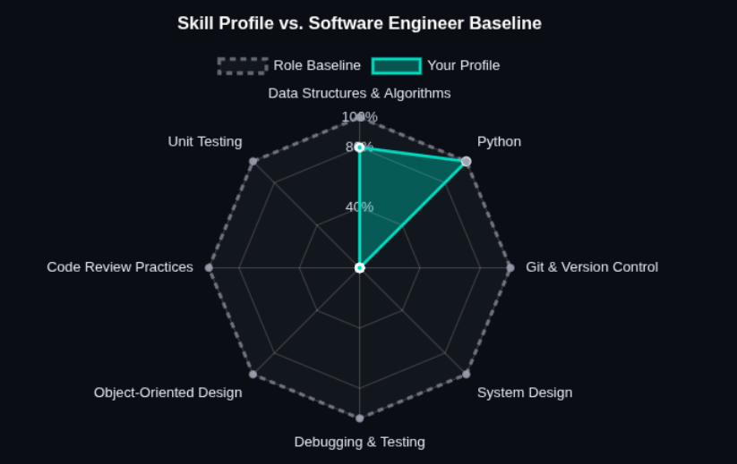
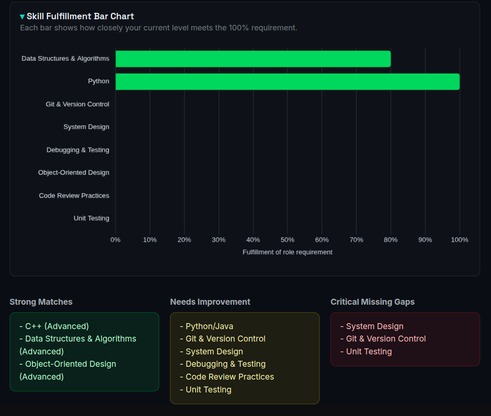
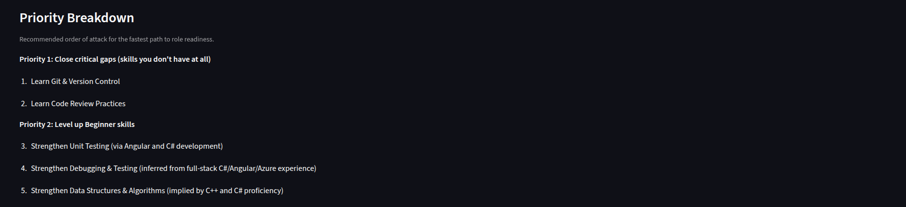

# SkillGap Intelligence

**AI-powered skill-gap and career-readiness analyzer**


Upload a resume or hand-pick your skills, choose a target job role, and get back a readiness score, a visual skill-gap breakdown, and an AI-written 4-week roadmap for closing the gaps - all in one Streamlit app.

## Table of Contents

- [Overview](#overview)
- [Features](#features)
- [How It Works](#how-it-works)
- [Tech Stack](#tech-stack)
- [Project Structure](#project-structure)
- [Supported Roles](#supported-roles)
- [Team](#team)
- [License](#license)

## Overview

SkillGap Intelligence answers one question for job seekers and career-switchers: **"How ready am I for this role, and what should I do next?"**

Instead of a static checklist, it uses an LLM to *semantically* compare your skills against a role's requirements - so knowing PyTorch can reasonably count toward "Machine Learning," the way a human recruiter would read a resume, rather than requiring an exact keyword match. The output is a readiness score, a categorized skill-gap breakdown, and a prioritized, project-based learning roadmap.

**Demo:** [skillprofile.streamlit.app](https://skillprofile.streamlit.app/)

## Features

- **Resume skill extraction** - upload a PDF/TXT resume; an LLM call pulls out technical skills and pre-fills the picker for you.
- **37 target roles across 14 domains** - software engineering, data, AI/ML, hardware & embedded, mobile, game dev, cloud & DevOps, cybersecurity, Web3, databases, QA, product/program management, design, and marketing (full list in [Supported Roles](#supported-roles)).
- **Skill picker** with 80+ predefined technologies, plus free-text custom skills for anything not on the list.
- **Per-skill proficiency sliders** - Beginner / Intermediate / Advanced - so the score reflects depth, not just familiarity.
- **AI semantic gap analysis** - Gemini-first, Llama-3.3-via-NVIDIA-fallback scoring of Role Readiness and Skill Coverage, with every required skill bucketed into Strong Match, Needs Improvement, or Critical Missing Gap. Falls back to deterministic keyword matching if no AI provider is reachable.
- **Radar + bar chart visualizations** of your profile against the role baseline.
- **Prioritized action plan** - critical gaps first, then beginner-level skills worth strengthening.
- **AI-generated 4-week learning roadmap** for critical gaps, with every topic linked out to a YouTube search.
- **One-click Markdown report** of the full assessment, ready to download.

## How It Works

**1. Upload your resume** *(optional)* and extract skills automatically.



**2. Pick a target role and set your skills** - from the extracted resume, the predefined list, or typed in manually.



**3. Set a proficiency level** for each skill you've selected.



**4. Click Analyze.** The app calls the LLM to semantically score your profile, with live status as it works.



**5. Read your results** - Role Readiness, Skill Coverage, Strong Matches, and Critical Gaps, at a glance.



**6. Explore the Gap Analysis tab** for a radar chart of your profile against the role baseline...



...and a color-coded fulfillment bar chart, with your skills sorted into Strong Matches, Needs Improvement, and Critical Missing Gaps.



**7. Switch to the Action Plan tab** for a prioritized breakdown of what to tackle first, an AI-written 4-week roadmap, and a one-click Markdown report download.



## Tech Stack

| Layer | Tools |
|---|---|
| UI | [Streamlit](https://streamlit.io/) |
| AI / LLM | [Google Gemini](https://ai.google.dev/)  [Llama 3.3 70B via NVIDIA NIM](https://build.nvidia.com/) (fallback) |
| Charts | [Plotly](https://plotly.com/python/) (radar + bar charts) |
| Resume parsing | [PyPDF2](https://pypi.org/project/PyPDF2/) |
| Language | Python 3 |

## Project Structure

```text
DevStorm/
├── app.py              # Main Streamlit app - UI, scoring logic, charts, LLM calls
├── brain.py             # Scaffolded FastAPI microservice, not currently used by app.py
├── requirements.txt     # Pinned Python dependencies
├── .devcontainer/        # Dev container config (GitHub Codespaces)
└── .gitignore
```

## Supported Roles

<details>
<summary>37 target roles across 14 domains (click to expand)</summary>

**Core Software Engineering**
Software Engineer · Full Stack Developer · Backend Developer · Frontend Developer

**Data**
Data Scientist · Data Engineer · Data Analyst

**AI / Machine Learning**
AI Engineer · Machine Learning Engineer · MLOps Engineer · NLP Engineer · Computer Vision Engineer · Robotics Engineer

**Hardware & Systems**
Embedded Systems Engineer · IoT Architect · Firmware Engineer · Hardware Design Engineer · Systems Optimization Engineer

**Mobile**
Android Developer · iOS Developer

**Game Development**
Game Developer · Game Designer

**Cloud & Infrastructure**
Cloud Architect · DevOps Engineer · Site Reliability Engineer

**Cybersecurity**
Cybersecurity Analyst · Penetration Tester · Security Engineer

**Web3 / Blockchain**
Blockchain Developer · Web3 Engineer

**Databases**
Database Administrator · Database Engineer

**QA**
QA Automation Engineer

**Product & Program Management**
Product Manager · Technical Program Manager

**Design**
UX/UI Designer

**Marketing**
Digital Marketing Specialist

Each role has its own curated list of required skills and a typical experience level, defined in `app.py`.

</details>

## Team

Built by [@iwannabemitul](https://github.com/iwannabemitul), [@sharma-ronak](https://github.com/sharma-ronak75), [@nitika](https://github.com/thenitikakaushik) for the DevStorm 2026 Hackathon (Round - 1).

## License

No license file is currently included in this repository. Until one is added, all rights are reserved by the authors - reach out before reusing this code outside the hackathon.

