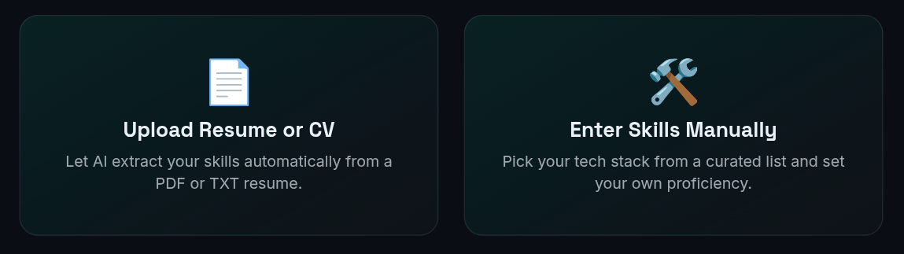
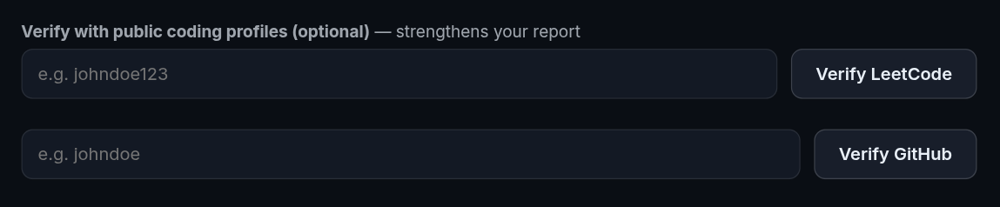
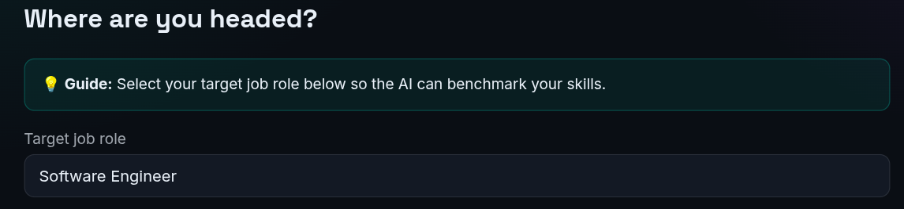
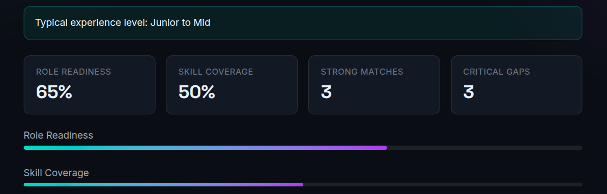
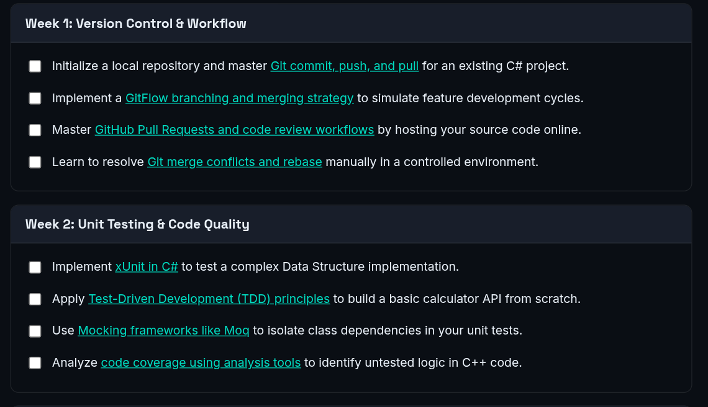
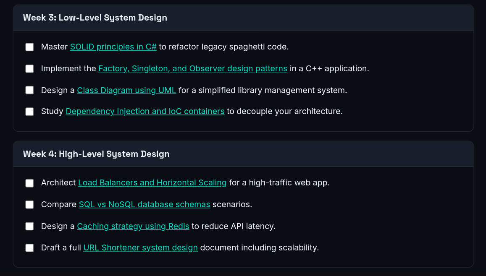
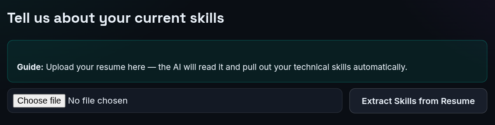

# SkillGap Intelligence

**AI-powered skill-gap and career-readiness analyzer**


SkillGap Intelligence helps students and developers understand **how ready they are for a target technical role and what they should learn next**.

Choose between uploading a resume/CV or entering skills manually, optionally verify public coding profiles, select a target job role, and receive an AI-powered readiness assessment with visual skill-gap analysis and a structured 4-week learning roadmap.

The project now uses a **vanilla HTML/CSS/JavaScript frontend with a Node.js server**, replacing the previous Streamlit/Python application. AI requests are handled through the **NVIDIA API**, with the API key kept on the server through environment variables.

---

## Table of Contents

- [Overview](#overview)
- [Features](#features)
- [How It Works](#how-it-works)
- [Screenshots](#screenshots)
- [Architecture](#architecture)
- [Tech Stack](#tech-stack)
- [Environment Variables](#environment-variables)
- [Getting Started](#getting-started)
- [Project Structure](#project-structure)
- [AI Analysis](#ai-analysis)
- [Supported Roles](#supported-roles)
- [Security Notes](#security-notes)
- [Team](#team)
- [License](#license)

---

## Overview

SkillGap Intelligence answers one question for job seekers, students, and career-switchers:

> **"How ready am I for this role, and what should I do next?"**

Instead of relying only on exact keyword matches, the application uses AI to evaluate a user's skills against the requirements of a selected target role.

The result includes:

- **Role Readiness** score
- **Skill Coverage** score
- **Strong Matches**
- **Needs Improvement**
- **Critical Missing Gaps**
- A visual **skill profile vs. role baseline**
- A skill-fulfillment breakdown
- A prioritized **4-week learning roadmap**

The application is designed as a browser-based web app, with the frontend communicating with a Node.js backend that handles server-side processing and NVIDIA API requests.

---

## Features

### Resume / CV Analysis

Upload a supported resume and let the application extract relevant technical skills automatically.



The interface provides two paths:

- **Upload Resume or CV** — automatically extract skills from a PDF/TXT resume.
- **Enter Skills Manually** — choose technologies and set proficiency yourself.

### Manual Skill Selection

Users can manually build their technical profile and specify their proficiency for each selected skill.

This allows the assessment to account for the difference between simply knowing a technology and having advanced experience with it.

### Public Coding Profile Verification

Users can optionally provide:

- **LeetCode username**
- **GitHub username**

These public profiles can be used to strengthen the assessment with additional evidence of practical coding activity.



### Target Role Benchmarking

Select the role you are targeting and use its curated skill requirements as the benchmark for the analysis.



### AI-Powered Skill Gap Analysis

The backend sends the relevant assessment data to an LLM through the **NVIDIA API**.

The analysis evaluates the relationship between the user's current skills and the target role rather than treating the profile as a simple keyword checklist.

The dashboard summarizes the result using:

- Role Readiness
- Skill Coverage
- Strong Matches
- Critical Gaps



### Visual Skill Analysis

The results include visualizations that make gaps easier to understand.

The radar view compares the user's profile with the selected role's expected baseline.


The fulfillment chart shows how closely individual skills meet the role requirements.


### Prioritized Learning Roadmap

The application turns the identified gaps into an actionable **4-week roadmap**.

The roadmap focuses on practical tasks and learning activities rather than only listing topics.





---

## How It Works

### 1. Choose how to provide your skills

Start by either uploading a resume/CV or entering your skills manually.


### 2. Upload a resume or configure your skills

When a resume is uploaded, the application extracts relevant skills automatically.



### 3. Optionally verify public coding profiles

Provide your LeetCode and GitHub usernames if you want public coding activity to contribute additional evidence.


### 4. Select your target role

Choose the job role you are preparing for.


### 5. Analyze your readiness

The Node.js server processes the assessment and uses the NVIDIA API for AI-powered analysis.

The dashboard presents the resulting readiness and coverage metrics.


### 6. Explore the skill gaps

Use the radar and fulfillment visualizations to see where your profile is strong and where it falls short of the target role.


### 7. Follow the 4-week roadmap

The identified gaps are converted into a structured learning plan covering four weeks.


---

## Architecture

The application follows a simple client-server architecture:

```text
┌───────────────────────────────┐
│        Browser / Client       │
│                               │
│  HTML + CSS + JavaScript      │
│  • Forms                      │
│  • Skill selection            │
│  • Dashboard                  │
│  • Charts                     │
│  • 4-week roadmap             │
└───────────────┬───────────────┘
                │ HTTP / API requests
                ▼
┌───────────────────────────────┐
│          Node.js Server       │
│                               │
│  • API routes                 │
│  • Request validation         │
│  • Resume/profile processing  │
│  • Analysis orchestration     │
│  • NVIDIA API communication   │
└───────────────┬───────────────┘
                │
                │ NVIDIA API
                ▼
┌───────────────────────────────┐
│       NVIDIA AI Platform      │
│                               │
│  LLM-powered skill analysis   │
│  and roadmap generation       │
└───────────────────────────────┘
```

### Why the backend handles the NVIDIA API call

The NVIDIA API key should **never be exposed in browser-side JavaScript**.

The frontend sends the assessment data to the Node.js server. The server reads `NVIDIA_API_KEY` from the environment and makes the AI request.

```text
Frontend
   │
   │ assessment data
   ▼
Node.js backend
   │
   │ NVIDIA_API_KEY
   ▼
NVIDIA API
   │
   │ AI analysis
   ▼
Node.js backend
   │
   │ result
   ▼
Frontend
```

---

## Tech Stack

| Layer | Technology |
|---|---|
| Frontend | HTML5 |
| Styling | CSS3 |
| Client-side logic | Vanilla JavaScript |
| Server | Node.js |
| AI / LLM | NVIDIA API |
| AI authentication | `NVIDIA_API_KEY` environment variable |
| Visualizations | Browser-side JavaScript charting / visualization layer |
| Resume input | PDF/TXT upload handled by the web application |
| Communication | HTTP / JSON API |

> **Note:** The current version no longer depends on Streamlit, Python, PyPDF2, or Plotly Python.

---

## Environment Variables

Create a `.env` file in the Node.js server project:

```env
NVIDIA_API_KEY=your_nvidia_api_key_here
PORT=3000
```

The exact port can be changed to match the server configuration.

### NVIDIA API Key

The application requires an NVIDIA API key for AI-powered analysis.

Obtain the key from the NVIDIA developer platform and keep it private.

**Never put the NVIDIA API key in:**

- `index.html`
- browser-side JavaScript
- CSS files
- screenshots
- GitHub commits
- public configuration files

Use an environment variable on the Node.js server instead.

---

## Getting Started

### Prerequisites

Make sure you have:

- Node.js installed
- npm installed
- An NVIDIA API key
- A modern web browser

Check your Node.js installation:

```bash
node --version
npm --version
```

### 1. Clone the repository

```bash
git clone https://github.com/Iwannabemitul/DevStorm.git
cd DevStorm
```

### 2. Install dependencies

```bash
npm install
```

### 3. Configure environment variables

Create `.env`:

```env
NVIDIA_API_KEY=your_nvidia_api_key_here
PORT=3000
```

### 4. Start the server

Use the start command defined in `package.json`, for example:

```bash
npm start
```

For development, if a development script is configured:

```bash
npm run dev
```

### 5. Open the application

Open the local URL printed by the Node.js server, commonly:

```text
http://localhost:3000
```

---

## Project Structure

The exact filenames may evolve as the application grows, but the current architecture follows the frontend/server separation below:

```text
DevStorm/
├── frontend/                 # Browser-facing application
│   ├── index.html            # Main HTML interface
│   ├── css/                  # Stylesheets
│   ├── js/                   # Client-side JavaScript
│   └── assets/               # Images and other frontend assets
│
├── server/                   # Node.js backend
│   ├── routes/               # API endpoints
│   ├── services/             # Analysis / external API logic
│   └── ...                   # Server configuration and utilities
│
├── screenshots/              # Project screenshots
├── .env                      # Local secrets (do not commit)
├── .env.example              # Environment variable template
├── package.json              # Node.js dependencies and scripts
├── package-lock.json         # Locked dependency versions
└── README.md
```

> Adjust the folder names above if the repository uses a different frontend/server directory layout. The important architectural distinction is that **browser code handles the UI while Node.js handles server-side/API responsibilities**.

---

## AI Analysis

The AI layer is responsible for turning the user's profile and target role into a useful career-readiness assessment.

A typical analysis flow is:

```text
User Skills
    +
Proficiency Levels
    +
Target Role Requirements
    +
Optional Public Profile Data
    │
    ▼
Node.js Analysis Service
    │
    ▼
NVIDIA API / LLM
    │
    ▼
Structured Assessment
    │
    ├── Role Readiness
    ├── Skill Coverage
    ├── Strong Matches
    ├── Needs Improvement
    ├── Critical Missing Gaps
    └── Learning Roadmap
```

The generated results are then presented through the web interface using cards, charts, categorized gap lists, and the four-week roadmap.

---

## Supported Roles

The application supports a broad set of technical and professional roles, including:

<details>
<summary>37 target roles across 14 domains</summary>

### Core Software Engineering

- Software Engineer
- Full Stack Developer
- Backend Developer
- Frontend Developer

### Data

- Data Scientist
- Data Engineer
- Data Analyst

### AI / Machine Learning

- AI Engineer
- Machine Learning Engineer
- MLOps Engineer
- NLP Engineer
- Computer Vision Engineer
- Robotics Engineer

### Hardware & Systems

- Embedded Systems Engineer
- IoT Architect
- Firmware Engineer
- Hardware Design Engineer
- Systems Optimization Engineer

### Mobile

- Android Developer
- iOS Developer

### Game Development

- Game Developer
- Game Designer

### Cloud & Infrastructure

- Cloud Architect
- DevOps Engineer
- Site Reliability Engineer

### Cybersecurity

- Cybersecurity Analyst
- Penetration Tester
- Security Engineer

### Web3 / Blockchain

- Blockchain Developer
- Web3 Engineer

### Databases

- Database Administrator
- Database Engineer

### QA

- QA Automation Engineer

### Product & Program Management

- Product Manager
- Technical Program Manager

### Design

- UX/UI Designer

### Marketing

- Digital Marketing Specialist

</details>

Each role is associated with a curated set of expected skills and an appropriate experience benchmark.

---

## Screenshots

### Input & Profile Setup

| Input methods | Resume upload |
|---|---|
|  |  |

| Public profile verification | Target role |
|---|---|
|  |  |

### Analysis Dashboard


### 4-Week Roadmap


---

## Security Notes

Because the application uses an external AI API:

1. **Keep `NVIDIA_API_KEY` server-side.**
2. Add `.env` to `.gitignore`.
3. Never hard-code the API key in JavaScript.
4. Never commit real API keys to GitHub.
5. Use `.env.example` with placeholder values only.
6. Validate and sanitize data received from the browser before sending it to external services.
7. Avoid logging API keys or sensitive user data.

Example `.gitignore` entries:

```gitignore
node_modules/
.env
.env.*
!.env.example
```

---

## Architecture
```text
HTML + CSS + JavaScript + Node.js
NVIDIA API
```
---

## Team

Built by [@iwannabemitul](https://github.com/Iwannabemitul), [@sharma-ronak](https://github.com/sharma-ronak75), and [@nitika](https://github.com/thenitikakaushik) for the **DevStorm 2026 Hackathon (Round - 1)**.

---

## License

No license file is currently included in this repository.

Until a license is added, **all rights are reserved by the authors**. Please reach out to the project authors before reusing or redistributing the code outside the hackathon.
